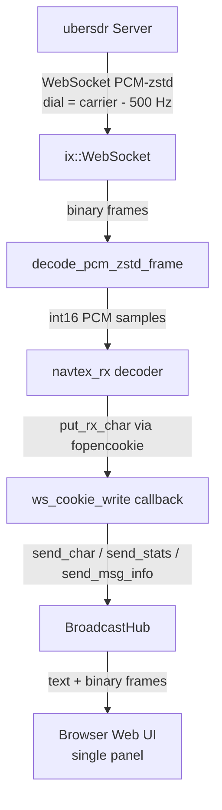
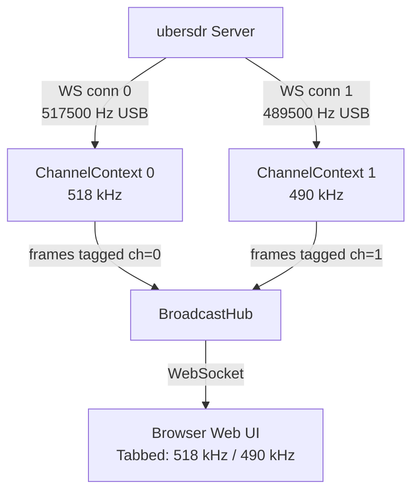

# Multi-Frequency NAVTEX Reception — Design Document

## Overview

NAVTEX operates on two internationally standardised carrier frequencies:

| Frequency | Name | Coverage |
|-----------|------|----------|
| **518 kHz** | International NAVTEX | Worldwide, messages in English |
| **490 kHz** | National NAVTEX | Regional/coastal, local language |

The current implementation monitors **one frequency at a time**, selected via the `NAVTEX_FREQ` environment variable. This document describes the changes required to monitor **both frequencies simultaneously** from a single process, with a **tabbed web UI** showing each frequency in its own panel.

> **Design decision:** Dual-frequency operation is the **only supported mode**. There is no single-frequency fallback. The binary always monitors both 518 kHz and 490 kHz. The `NAVTEX_FREQ` environment variable is replaced by `NAVTEX_FREQ_1` (default `518000`) and `NAVTEX_FREQ_2` (default `490000`), both of which are always required.

---

## Current Architecture (Single Frequency)



### Key globals that assume a single channel

| Symbol | Location | Problem |
|--------|----------|---------|
| `g_hub` | [`navtex_rx_from_ubersdr.cpp:466`](../src/navtex_rx_from_ubersdr.cpp:466) | Single hub pointer used by `ws_cookie_write` |
| `g_last_char_ms` | [`navtex_rx_from_ubersdr.cpp:469`](../src/navtex_rx_from_ubersdr.cpp:469) | Single timestamp for "active" detection |
| `g_msg_parser` | [`navtex_rx_from_ubersdr.cpp:544`](../src/navtex_rx_from_ubersdr.cpp:544) | Single ZCZC/NNNN framing parser |

---

## Target Architecture (Dual Frequency)



Each channel runs its own **reconnect loop in a `std::thread`**, completely independently. The `BroadcastHub` is shared and thread-safe (it already uses `getClients()` which is internally locked in IXWebSocket).

---

## C++ Changes

### 1. `ChannelContext` struct

Replace all per-channel globals with a single struct that is instantiated once per frequency:

```cpp
struct ChannelContext {
    int                    channel_id;      // 0 = 518 kHz, 1 = 490 kHz
    long                   carrier_hz;      // e.g. 518000
    long                   dial_hz;         // carrier_hz - 500
    std::string            session_id;      // UUID for this channel's SDR session
    std::string            ws_url;          // full WebSocket URL

    // Decoder state
    navtex_rx *            decoder = nullptr;
    FILE *                 broadcast_file = nullptr;
    int                    current_sample_rate = 12000;

    // Per-channel framing parser and activity tracking
    MsgParser              msg_parser;
    std::atomic<int64_t>   last_char_ms{0};

    // Cached signal quality
    float                  cached_bb_power  = 0.0f;
    float                  cached_noise_den = 0.0f;
    bool                   cached_has_sq    = false;

    // PCM decode buffers
    PcmMeta                meta;
    std::vector<uint8_t>   decomp_buf;
    std::vector<int16_t>   pcm_le;
};
```

### 2. `ws_cookie_write` becomes per-channel

The `fopencookie` write callback currently reads `g_hub`, `g_last_char_ms`, and `g_msg_parser` as globals. With `ChannelContext`, the cookie pointer (currently `nullptr`) is replaced with a pointer to the `ChannelContext`, so the callback can:

- Call `hub->send_char(channel_id, c)` (channel-tagged)
- Call `hub->send_msg_info(channel_id, ...)` (channel-tagged)
- Update `ctx->last_char_ms`
- Feed `ctx->msg_parser`

### 3. `BroadcastHub` gains a `channel_id` parameter on all send methods

```cpp
void send_char    (int ch, char c);
void send_stats   (int ch, uint32_t rate, bool has_sq, float bb, float nd,
                   bool active, const DecoderStats &dec);
void send_msg_info(int ch, bool in_message, bool complete,
                   char station, char subject, int serial);
void send_audio   (int ch, const std::vector<int16_t> &pcm);
```

### 4. Wire frame protocol — add channel byte

Every binary frame sent to the browser gains a **channel byte at offset 1** (after the type byte at offset 0). All frame sizes increase by 1 byte.

| Frame type | Old layout | New layout |
|------------|-----------|------------|
| `0x02` stats | `[type][20 bytes]` | `[type][ch][20 bytes]` = 22 bytes |
| `0x03` msg-info | `[type][4 bytes]` | `[type][ch][4 bytes]` = 6 bytes |
| `0x04` audio | `[type][int16 samples...]` | `[type][ch][int16 samples...]` |
| text char | plain text `"X"` | plain text `"X"` prefixed with channel: `"0X"` or `"1X"` |

> **Note:** Text frames (decoded characters) are prefixed with the channel digit (`"0"` or `"1"`) so the browser can route them to the correct output panel without needing a binary frame.

### 5. Per-channel reconnect threads

`main()` creates a `std::vector<ChannelContext>` (one entry per configured frequency), then spawns one `std::thread` per channel. Each thread runs the existing reconnect loop logic, operating entirely on its own `ChannelContext`. The main thread waits on all channel threads (or runs the web server loop).

### 6. Argument parsing

The binary no longer accepts a `frequency_hz` positional argument. The two frequencies are fixed at `518000` and `490000` and are always monitored. The only runtime argument besides the server URL is `--web-port`:

```
navtex_rx_from_ubersdr <http://host:port> [--web-port N]
```

The frequencies can be overridden at build time or via environment variables (`NAVTEX_FREQ_1` / `NAVTEX_FREQ_2`) passed through the entrypoint, but the binary always starts **two** channel threads — one per frequency.

---

## Web UI Changes

### Tab design

The single-panel HTML page is replaced with a **two-tab layout**:

```
┌─────────────────────────────────────────────────────────┐
│  📡 NAVTEX   SDR: http://...   Status: ● Connected       │
├──────────────┬──────────────────────────────────────────┤
│ [518 kHz ●] │ [490 kHz ○]                               │
├─────────────────────────────────────────────────────────┤
│  Signal: -45.2 dBFS  Noise: -89.1  SNR: 43.9 dB  ...   │
│  Message: Receiving…  Station: E  Subject: A  Serial: 01 │
│                                                          │
│  ZCZC EA01                                               │
│  NAVTEX MESSAGE TEXT HERE...                             │
│  NNNN                                                    │
└─────────────────────────────────────────────────────────┘
```

- **Tab bar**: one tab per channel, showing frequency label and a live status dot (green = active/locked, amber = syncing, grey = searching)
- **Stats bar**: per-tab, shows signal/noise/SNR/FEC/decoder state for the active tab
- **Message bar**: per-tab, shows current ZCZC framing state
- **Output area**: per-tab, scrolling decoded text
- **Audio preview button**: per-tab (only one channel can stream audio at a time to avoid mixing)

### JavaScript routing

The browser WebSocket `onmessage` handler reads the channel byte from binary frames (offset 1) and the channel digit prefix from text frames, then updates only the DOM elements belonging to that channel's tab panel.

Each tab panel has its own set of DOM element IDs suffixed with the channel index, e.g.:
- `output-0`, `output-1`
- `bb-val-0`, `bb-val-1`
- `dec-state-0`, `dec-state-1`
- `msg-bar-0`, `msg-bar-1`

---

## Configuration Changes

### `entrypoint.sh`

The entrypoint passes both frequencies to the binary. Both are always required — there is no single-frequency mode.

```sh
URL="${UBERSDR_URL:-http://ubersdr:8080}"
FREQ1="${NAVTEX_FREQ_1:-518000}"
FREQ2="${NAVTEX_FREQ_2:-490000}"
PORT="${WEB_PORT:-6092}"

exec /usr/local/bin/navtex_rx_from_ubersdr \
    "$URL" \
    --freq "$FREQ1" \
    --freq "$FREQ2" \
    --web-port "$PORT"
```

### `docker-compose.yml`

```yaml
environment:
  UBERSDR_URL: "http://ubersdr:8080"
  NAVTEX_FREQ_1: "518000"   # International (English)
  NAVTEX_FREQ_2: "490000"   # National/coastal
  # WEB_PORT: "6092"
```

---

## Thread Safety Considerations

| Concern | Mitigation |
|---------|-----------|
| Two threads calling `hub.send_*()` concurrently | `ix::HttpServer::getClients()` is internally mutex-protected in IXWebSocket; `send_*` methods only read the client list and call `ws->sendBinary/sendText` which is thread-safe per IXWebSocket docs |
| `audio_subs` set in `BroadcastHub` | Already protected by `audio_subs_mu` mutex; extend to be keyed by `(channel_id, ws*)` |
| `ChannelContext::decoder` (navtex_rx) | Each channel owns its decoder exclusively — no sharing, no lock needed |
| `ChannelContext::msg_parser` | Owned exclusively by its channel thread — no lock needed |

---

## Implementation Todo List

- [ ] Define `ChannelContext` struct (replaces `g_hub`, `g_last_char_ms`, `g_msg_parser` globals)
- [ ] Refactor `ws_cookie_write` to accept `ChannelContext*` as the fopencookie cookie pointer
- [ ] Add `channel_id` parameter to all `BroadcastHub::send_*` methods
- [ ] Update all binary frame layouts to include channel byte at offset 1 (stats, msg-info, audio)
- [ ] Update text frame format to prefix channel digit (`"0X"` / `"1X"`)
- [ ] Simplify `main()` argument parsing: remove positional `frequency_hz`, add `--freq N` flag (repeatable), always require exactly two `--freq` values
- [ ] Spawn exactly two `std::thread` instances (one per channel), each running the full reconnect loop
- [ ] Rewrite `make_html_page()` with tabbed layout (tab per channel, all stats/output/audio per tab)
- [ ] Update JavaScript frame parser to route by channel byte/prefix to correct tab panel DOM elements
- [ ] Update `entrypoint.sh`: replace `NAVTEX_FREQ` with `NAVTEX_FREQ_1` + `NAVTEX_FREQ_2`, pass as `--freq` args
- [ ] Update `docker-compose.yml`: replace `NAVTEX_FREQ` with `NAVTEX_FREQ_1` + `NAVTEX_FREQ_2`
- [ ] Update `README.md` to document dual-frequency-only operation and new env vars
